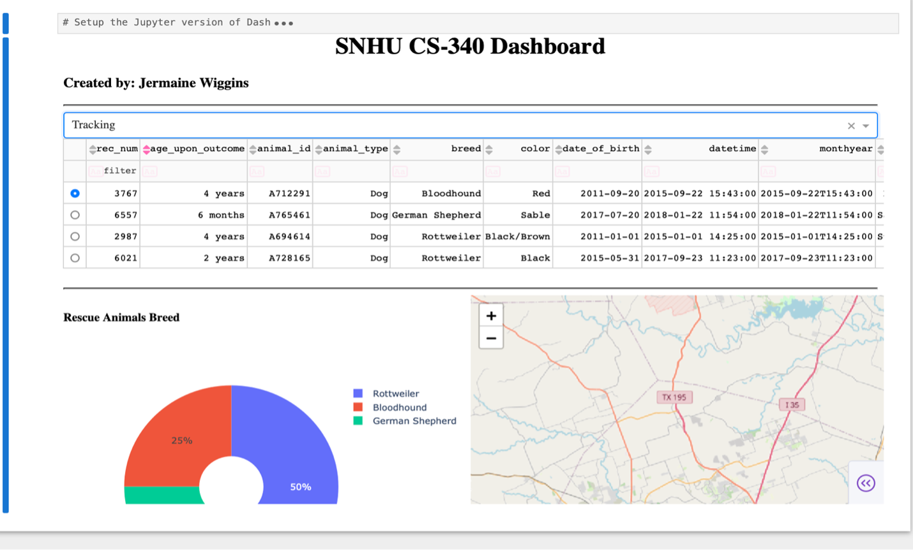
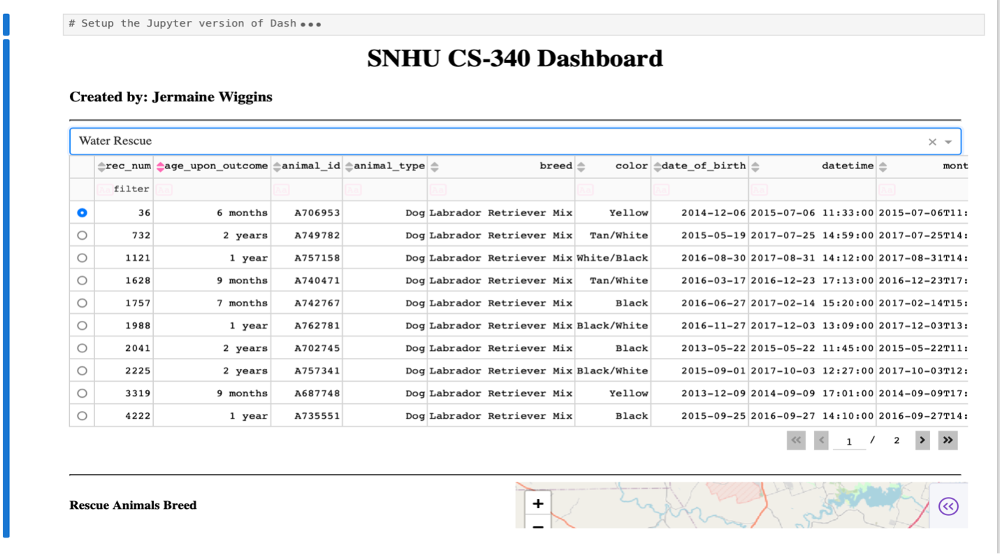

# CS340
*Contains my Final project from the term*

## Functionality and purpose
SNHU Dashboard was created to provide a user-friendly UI that enables non-technical users the ability to query a database.

## Preview 👀

## To get a local copy up and running follow these steps 🏃💨 
- Download zip file (project 2) containing 
  - projectTwo.ipynb
  - projectTwo.py
- Launch Jupyter notebook and open projectTwo.ipynb
- Run first cell to launch web application

## Tools (HyperLink to download) 🛠️
  - [MongoDB](https://www.mongodb.com/try/download/community) – database for storing data
  - [Python 3.8+](https://www.python.org/downloads/) – programming language
  - [Dash](https://dash.plotly.com/) – web application framework

## Additional Resources 📚
- Juypter notebook is the development environment used to develop and test the code
- Pymongo connects python code to MongoDB
- Pandas – reading and cleaning data
- Matplotlib - create interactive plots 
- Numpy - mathematical operations

## Reflection 📝

### **How do you write programs that are maintainable, readable, and adaptable? Especially consider your work on the CRUD Python module from Project One, which you used to connect the dashboard widgets to the database in Project Two. What were the advantages of working in this way? How else could you use this CRUD Python module in the future?**

To write programs in a maintainable, readable, and adaptable way, it is important to separate backend logic from frontend logic as well as ensure each function does one specific thing with good naming conventions. This not only makes the code easier to read and debug, but also allows it to be easily adjusted and reused in future projects.

### **How do you approach a problem as a computer scientist? Consider how you approached the database or dashboard requirements that Grazioso Salvare requested. How did your approach to this project differ from previous assignments in other courses? What techniques or strategies would you use in the future to create databases to meet other client requests?**

When given a problem, the first step is to understand what the client wants and break down the requirements into more manageable steps. Once planning is done, each requirement becomes the focal point of the development process. For example, one of the requirements was to display database information based on filtered options. This requirement requires the application to read all records that match the filtered query and display them in the grid. This was handled with the read function in my CRUD module, which was tested to ensure it worked before creating the dashboard. My approach for this assignment differed from my previous coursework because it required me to think about how to connect the frontend to the backend and required further planning to ensure they worked together. A technique I plan to implement in the future is creating custom CRUD functions that are specific to the client to improve readability and make it easier to scale in the future.

### **What do computer scientists do, and why does it matter? How would your work on this type of project help a company, like Grazioso Salvare, to do their work better?**

Computer scientists solve problems efficiently by creating new technology that the average person can use to make their life easier. The dashboard application created for Grazioso Salvare is much easier to query than working directly with MongoDB and will require a smaller learning curve, with just familiarity with the dashboard. Also, the inclusion of built-in queries for rescue types will help employees using the dashboard to be more efficient, because they can click one button to view all water rescue animals instead of querying each attribute manually.
